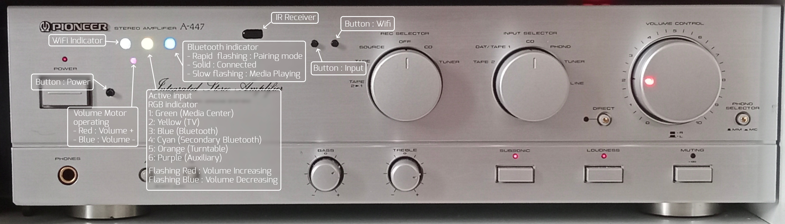

## **arduino-esp8266-amplifier-controller**  

Hybrid analog/digital amplifier controller with IR learning, motorized ALPS potentiometer feedback and ESP8266 web API.

# **Arduino + ESP8266 Amplifier Controller**  

This project is a comprehensive control system for a classic analog amplifier built using an Arduino Nano and ESP8266. The goal was to preserve the original analog character of the amplifier (including manual volume control) while adding modern features such as IR control, a web interface, a remote terrace panel, and a network API.  

The module is designed as an upgrade for a previous system based on the CD4017N microcontroller. The PCB is connected to a socket in place of the CD4017N.

### **Architecture**

The system is divided into two parts:  

#### **Arduino Nano**  

- Control of the ALPS motorized potentiometer (volume)  

- Reading the current position of the rotary volume knob via an analog input (with an added trim potentiometer for feedback)  

- IR receiver with the ability to learn up to 10 codes for each function (stored in EEPROM)  

- Control of input relays and speaker switching relays  

- RGB LED indication of the currently selected input  

   

#### **ESP8266**

- Web server with configuration and control interface  

- HTTP API for external control  

- Serial communication with the Arduino  
  
  

Both parts operate independently – a WiFi outage does not affect the basic functionality of the amplifier.  

### **Features**

#### **IR Learning (EEPROM)**  

Each function can have up to 10 different IR codes assigned:  

- Volume +  
- Volume -  
- Power  
- Input  
- Speakers  
- Media Play/Pause  
- Media Next  
- Media Previous  
  

This allows multiple remote controls to be used simultaneously.  

#### **Volume – Hybrid Solution**  

An ALPS motorized potentiometer is used.  

Analog position sensing has been added, which means:  

- the volume can be adjusted by the motor (IR, web, HW buttons)  
- it can also be changed manually by turning the knob  
- the Arduino always knows the current physical position  
  

This preserves full analog functionality while adding digital control.  

#### **Audio Inputs**  

- 6 inputs  
- RGB LED indicates the active input  
- Input 3 contains an internal Bluetooth module  
- Input 4 contains an external Bluetooth module located in the terrace panel  
  

Each input can have an individual maximum volume limit set to prevent speaker overload when different signal levels are used.  

#### **Speaker Switching**  

The **Speakers** function switches between:  

- Living room speakers  
- Terrace speakers  

#### **Terrace Control Panel**  

The external panel includes:  

- Hardware buttons for all functions  
- A rotary volume control  
- An IR receiver  
  

The amplifier can therefore be fully controlled even outside the main room.  

#### **Web Interface (ESP8266)**  

The ESP8266 runs a simple web server that allows:  

- Control of all amplifier functions  
- Learning and deleting IR codes  
- Setting maximum volume limits for individual inputs  
- Displaying the current device status  

#### **HTTP API**  

The server accepts commands in the following format:  

SET_POWER_ON / SET_POWER_OFF  

SET_VOLUME_25  

SET_INPUT_2  

SET_SPEAKER_A / SET_SPEAKER_B  

PULSE_VOLUP  

PULSE_VOLDOWN  

SET_AUTO_OFF_<value_in_seconds> / SET_AUTO_OFF_0 – cancels the timer  

IR_LEARN_POWER (VOLUP, VOLDOWN, INPUT, SPEAKERS, PLAY, NEXT, PREV)  

IR_REMOVE_POWER (VOLUP, VOLDOWN, INPUT, SPEAKERS, PLAY, NEXT, PREV )  

IR_REMOVE_POWER_ALL  

SET_MAX_VOL_INPUT__<volume_value>   (sets the specified volume value as the limit)

SET_CURRENT_MAX_VOLUME  (sets the current volume as the limit)

WIPE_EEPROM (clears the EEPROM memory)

  

Each request returns a response containing the complete current device status.  

This API can be easily integrated into other systems – for example into the **Tasker** app, where a simple control application using HTTP commands has been created.  

____________________________________________________________________________________________________________________________________________________________________________________________________________________________________________________________________________________________________________________________________________

# **Arduino + ESP8266 Amplifier Controller**  

Tento projekt je komplexní řídicí systém pro klasický analogový zesilovač postavený na Arduino Nano a  ESP8266. Cílem bylo zachovat původní analogový charakter zesilovače (včetně manuálního ovládání hlasitosti), ale doplnit jej o moderní funkce – IR ovládání, webové rozhraní, vzdálený panel na terase a síťové API. 

Modul je koncipován jako upgrade pro předchozí systém postavený na mikrokontroléru CD4017N. PCB je připojena do patice na místo CD4017N.

### **Architektura**

Systém je rozdělen na dvě části:  

#### **Arduino Nano**  

- Řízení motorizovaného potenciometru ALPS (hlasitost)  

- Snímání aktuální polohy otočného ovladače hlasitosti přes analogový vstup (přidaný trimr pro zpětnou vazbu)  

- IR přijímač s možností učení až 10 kódů na každou funkci (uloženo v EEPROM)  

- Ovládání relé vstupů a reproduktorových větví  

- RGB LED indikace aktuálního vstupu  

   

#### **ESP8266**

- Web server s konfiguračním a ovládacím rozhraním  

- HTTP API pro externí řízení  

- Sériová komunikace s Arduinem 
  
  

 Obě části fungují nezávisle – výpadek WiFi neovlivní základní funkčnost zesilovače.  

### **Funkce**

#### **IR učení (EEPROM)**  

Každé funkci lze přiřadit až 10 různých IR kódů:  

- Volume +  
- Volume -  
- Power  
- Input  
- Speakers  
- Media Play/Pause  
- Media Next  
- Media Previous  
  

To umožňuje používat více dálkových ovladačů současně.  

#### **Hlasitost – hybridní řešení**  

Použit je motorizovaný potenciometr ALPS.  

   Bylo doplněno analogové snímání polohy, takže:  
- hlasitost lze měnit motorem (IR, web, HW tlačítka)  
- lze ji měnit i ručně otočením knobu  
- Arduino vždy zná aktuální fyzickou polohu
  

 Zachována je tedy plná analogová funkčnost, ale s digitální kontrolou.  

#### **Audio vstupy**  

- 6 vstupů  
- RGB LED indikuje aktivní vstup  
- Na vstupu 3 je interní Bluetooth modul  
- Na vstupu 4 je externí Bluetooth modul umístěný v terasovém panelu  
  

 Pro každý vstup lze nastavit individuální maximální limit hlasitosti, aby nedošlo k přetížení reproduktorů při různých úrovních signálu.  

#### **Přepínání reproduktorů**  

Funkce **Speakers** přepíná mezi:  

- Reproduktory v obýváku  
- Reproduktory na terase  
  
    

#### **Terasový ovládací panel**  

Externí panel obsahuje:  

- HW tlačítka pro všechny funkce  
- Otočný ovladač hlasitosti  
- IR přijímač  
  

 Zesilovač je tedy plně ovladatelný i mimo hlavní místnost.  

#### **Webové rozhraní (ESP8266)**  

ESP8266 provozuje jednoduchý web server, který umožňuje:  

- Ovládání všech funkcí zesilovače  
- Učení a mazání IR kódů  
- Nastavení maximální hlasitosti pro jednotlivé vstupy  
- Zobrazení aktuálního stavu zařízení  
  
    

#### **HTTP API**  

Server přijímá příkazy ve formátu:  

SET_POWER_ON / SET_POWER_OFF  

SET_VOLUME_25  

SET_INPUT_2  

SET_SPEAKER_A / SET_SPEAKER_B

PULSE_VOLUP  

PULSE_VOLDOWN  

SET_AUTO_OFF_<hodnota_v_sekundách> / SET_AUTO_OFF_0 – zruší časovač 

IR_LEARN_POWER (VOLUP, VOLDOWN, INPUT, SPEAKERS, PLAY, NEXT, PREV)  

IR_REMOVE_POWER (VOLUP, VOLDOWN, INPUT, SPEAKERS, PLAY, NEXT, PREV )  

IR_REMOVE_POWER_ALL  

SET_MAX_VOL_INPUT__<hodnota_volume>   (nastaví zadanou hodnotu hlasitosti jako limit)

SET_CURRENT_MAX_VOLUME  (nastaví současnou hlasitost jako limit)

WIPE_EEPROM (vymaže paměť EEPROM)

​    

 Každý požadavek vrací odpověď obsahující kompletní aktuální stav zařízení.  

 Toto API lze snadno integrovat do jiných systémů – například do aplikace **Tasker**, kde je vytvořena jednoduchá ovládací aplikace využívající HTTP příkazy  

​    
